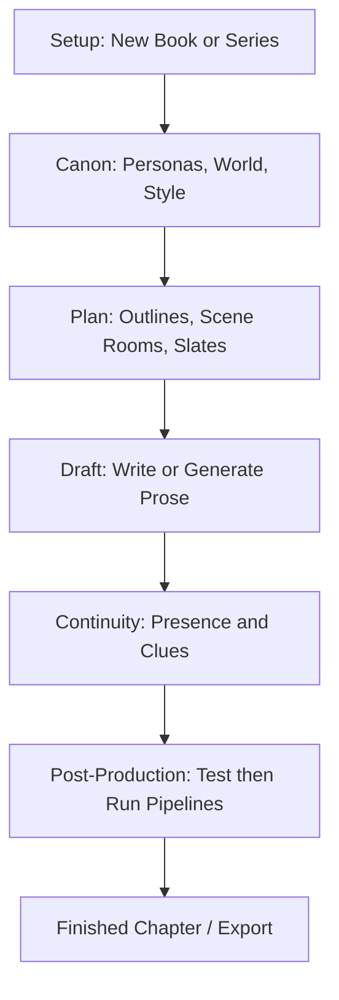

# Buckram Studio

> **Less "AI writing app," more "professional novel studio inside your editor."**

Buckram Studio is a Cursor-first VS Code extension for the full novel lifecycle—setup, plan, draft, and edit. It wraps professional book craft around plain Markdown on your disk, with AI as a co-writer and editorial engine—not a blank chat prompt.

---

## Why writers want it

- **One clear next step** — The Work Tree shows your book as stages: canon, outlines, drafts, post-production. You always know what to open next.
- **Canon that sticks** — Personas, world bible, and style rules feed every **Chat about** and draft—so you stop pasting the same world rules into every prompt.
- **Edit safely** — Multi-pass editorial pipelines run on a test sample first. Real chapter drafts change only when you choose to run production.
- **Your files, always** — Plain Markdown on *your* disk only. Buckram never stores your manuscript in the cloud—uninstall or leave Premium and every file stays readable and yours.

*Buckram Studio is for writers, not engineers.*

---

## Screenshots

<!-- Replace paths when assets are ready for the public repo -->

| Work Tree | Chapter panel |
| :-------: | :-----------: |
| *Coming soon* | *Coming soon* |

---

## Install

1. Open **Cursor** or **VS Code**.
2. Install **Buckram Studio** from the Marketplace *(link coming soon)*.
3. Open a folder for your series or book and use the Work Tree (book icon) to start.

**Zero setup:** marketplace install works without Python, pip, LibreOffice, or Pandoc for the basics—Work Tree, Chat about, bundled pipelines, and DOCX / Markdown / PDF / EPUB export.

LLM usage is **bring your own key** via Cursor Agent: you pay your provider; Buckram never locks your text behind our billing.

---

## How it compares

| Generic AI writing tools | Buckram Studio |
| :--- | :--- |
| Blank doc + copy-paste world rules into every prompt | Structured lifecycle: Work Tree, outlines, cast, production stages |
| "Polish this chapter" as one ad-hoc prompt | Multi-pass editorial pipelines with human gates |
| Manuscript in a proprietary cloud | Plain Markdown on your disk only—never on our servers |
| One generic AI voice | Per-persona voice profiles and craft-floor humanization |
| Continuity by memory or a second app | Presence dashboard, clue ledger, off-screen threads (no LLM required) |

---

## The writer journey

---

## What you get

- **Work Tree** — Command center for canon, books, chapters, pipelines, translations, export, and docs.
- **Canon & craft floor** — Personas, world bible, style rules, anti-slop guards, and voice humanization.
- **Plan rooms & Director** — Scene plans, on-stage checklists, pacing, and beat-to-prose expansion.
- **Chat about** — Agent chat with the right files attached; you type first; runs never auto-spend without confirmation.
- **Context compression** — Smart briefing for the model instead of dumping the whole series bible every time.
- **Post-production** — Author pipelines, test on a sandbox sample, then run on chapters when you're ready.
- **Continuity** — Presence, clue ledgers, and off-screen tracking without burning tokens.
- **Export** — KDP DOCX, Markdown, PDF, and EPUB from the book Export wizard.

---

## Free and Premium

Buckram charges for **automation scale**, not your manuscript. Your book stays as plain Markdown **on your disk**—we never host or lock the files.

| | Free | Premium |
| :--- | :--- | :--- |
| Planning, canon, Chat about, craft floor | Yes | Yes |
| Pipeline authoring & Testing sandbox | Yes | Yes |
| Manuscript word cap | 50,000 | Unlimited |
| Chapter & batch production runs | — | Yes |
| Export | Up to 2 chapters per run | Full book |
| Your manuscript | On your disk only — never on our servers | On your disk only — never on our servers |

---

## Getting the most from chat

> [!IMPORTANT]
> Long chapter chats fail for a structural reason—not because you "asked wrong." Inside the extension, open **Documentation → Read me first → How chat context works** (and *Getting the most from the context window*) for short habits that keep Agent chats productive.

Full getting-started and feature help live in the extension under **Work Tree → Documentation**.

---

## License

Proprietary — see [LICENSE](./LICENSE). Your books stay as local files on your disk and remain yours.