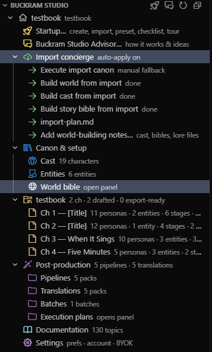
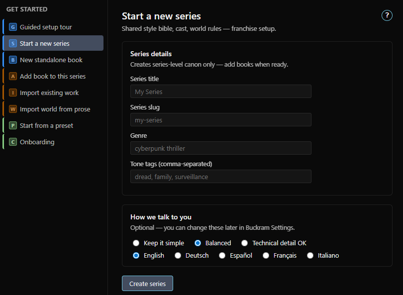
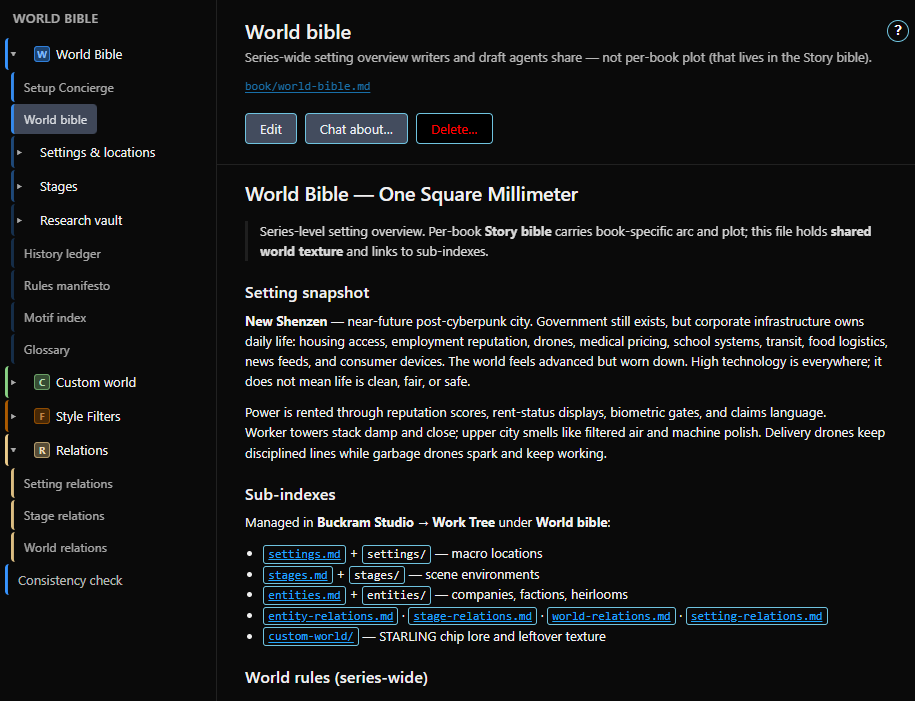
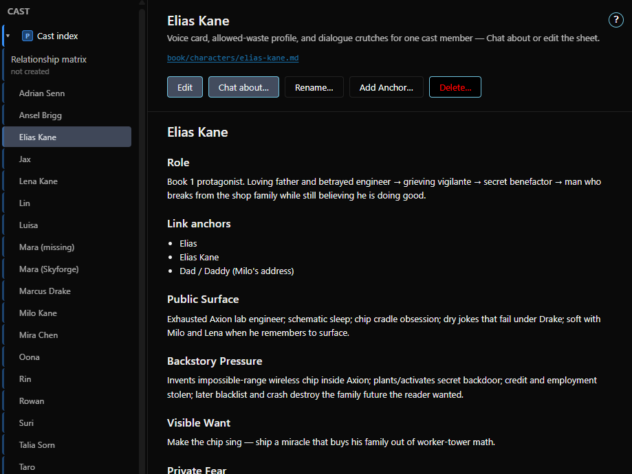
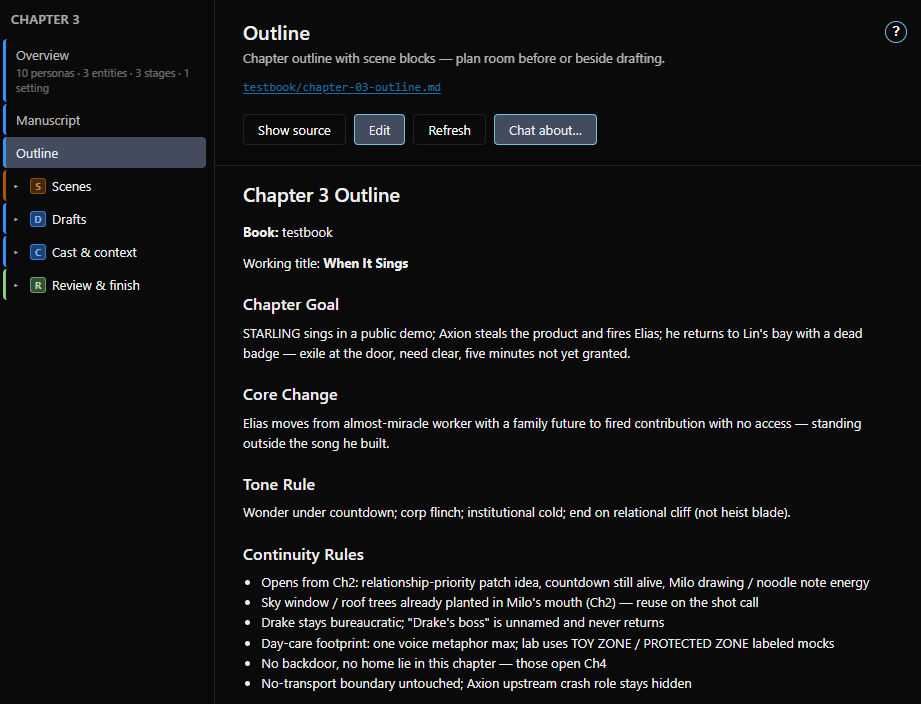
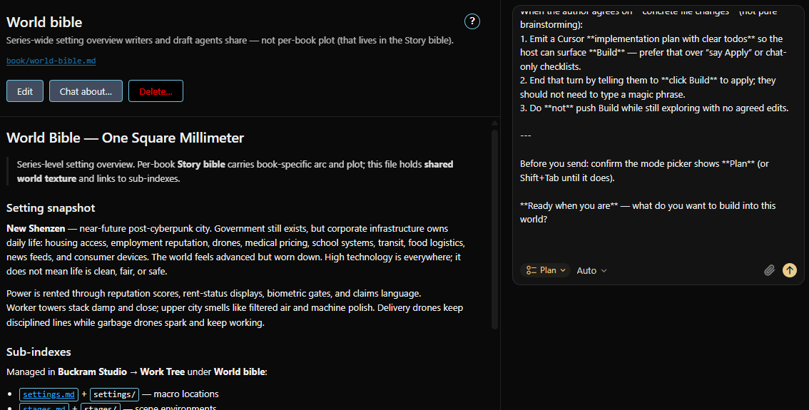
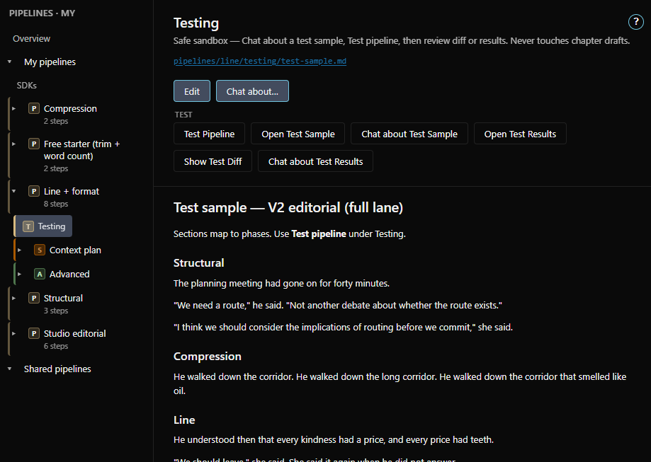
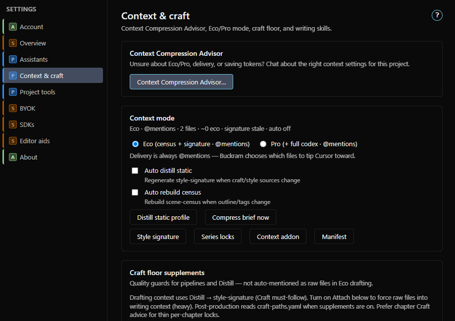
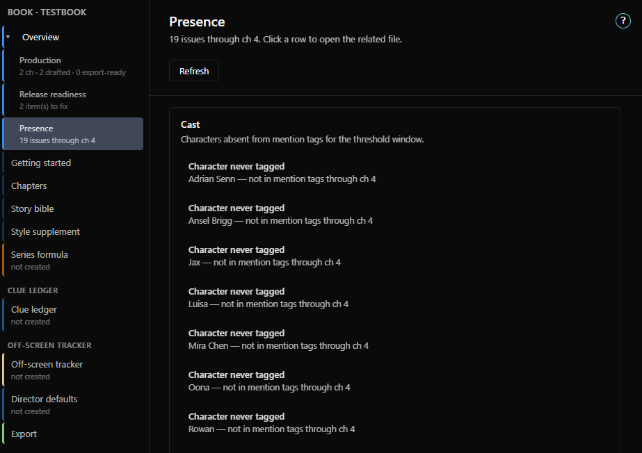
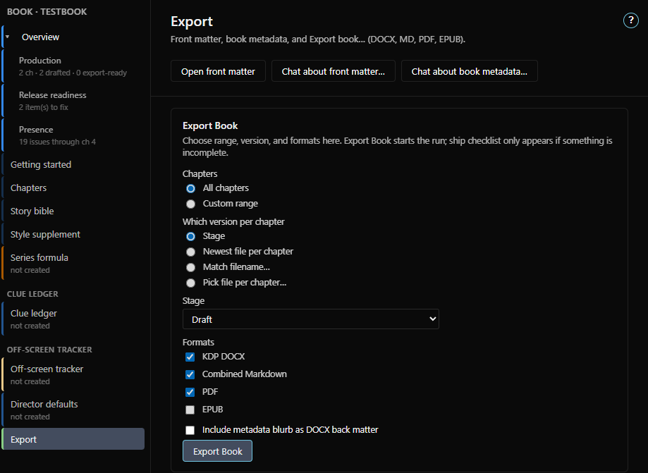

  

<h1 align="center">Buckram Studio</h1>

  <em>Guided book writing studio — setup, plan rooms, draft, editorial pipelines.</em>

  
  
  
  

> **Stop copy-pasting your world bible into a blank prompt.**

Buckram Studio is a Cursor extension for the full novel lifecycle — from empty folder to final draft. It wraps professional book craft around plain Markdown on your disk, so AI works as a structured co-writer and multi-pass editorial engine instead of a chaotic blank chat. Your files stay where they belong: local, readable, and yours.

<!-- TODO: produce media/readme/hero.gif — main demo loop: Work Tree -> Chat about -> draft appears (~1200px wide, < ~8 MB) -->

  

_Buckram Studio is for writers, not engineers._

---

## Why writers want it

- **One clear next step** — The Work Tree shows your book as stages: canon, outlines, drafts, post-production. You always know what to open next.
- **Canon that sticks** — Personas, world bible, and style rules feed every **Chat about** and draft, so you stop pasting the same world rules into every prompt.
- **Edit safely** — Multi-pass editorial pipelines run on a test sample first. Real chapter drafts change only when you choose to run production.
- **Your files, always** — Plain Markdown on _your_ disk. Buckram never stores your manuscript in the cloud; uninstall or leave Premium and every file stays readable and yours.

---

## What you get

- **Work Tree** — Command center for canon, books, chapters, scenes, pipelines, translations, export, and embedded docs. One obvious next action per row.
- **Canon & world-building** — Personas with voice profiles, world bible, stage/location bible, research vault, and a writing codex (glossary, motifs, clue ledger, relationship matrix, off-screen tracker).
- **Plan rooms & Director** — Chapter outlines with professional scene blocks, per-scene plan rooms, director slates, pacing/camera matrix, and beat-to-prose expansion.
- **Chat about** — Opens Cursor Agent chat with the right files already attached; you type first after **"Your turn."** Orchestrated runs end with **"Press Enter to start"** and never auto-spend without confirmation.
- **Editorial pipelines** — Author multi-pass post-production packs, test them on a sandbox sample, then run on real chapters when you are ready. Batch plans for multi-chapter runs.
- **Continuity intelligence** — Presence dashboard, clue ledger, and off-screen tracking flag forgotten personas, unpaid clues, and stale threads — no LLM tokens required.
- **Context compression** — Smart briefing (Eco / Pro) with scene census routing, so the model gets what a chapter needs instead of the whole series bible every click.
- **Craft floor** — Anti-slop rules, forbidden-phrase and gesture squiggles, and per-persona humanization keep the prose in your voice, not a generic AI one.
- **Export** — KDP-ready DOCX, Markdown, and PDF out of the box; EPUB via Pandoc (enhanced).

---

## Screenshots

| Work Tree | Get Started |
|-----------|-------------|
|  |  |

| World bible & canon | Cast |
|---------------------|------|
|  |  |

| Outline & Director | Chat about |
|--------------------|------------|
|  |  |

| Post-production (Testing) | Context compression |
|---------------------------|---------------------|
|  |  |

| Presence dashboard | Export |
|--------------------|--------|
|  |  |

---

## Getting started

1. Open **Cursor**.
2. Install **Buckram Studio** from the Extensions view (Cursor uses [Open VSX](https://open-vsx.org/extension/buckram/buckram-studio)).
3. Open a folder for your series or book, then click the **book icon** in the Explorer to open the Work Tree.
4. Use **Get Started** to create a new series, a standalone book, or add a book to a series, then follow the guided setup tour.

Full getting-started and feature help live inside the extension under **Work Tree → Documentation**.

---

## Free & Premium

Buckram charges for **automation scale, not access to your manuscript**. Your book stays as plain Markdown on your disk regardless of tier — files are never locked, deleted, or held hostage.

- **Free** — Work Tree, Chat about, canon, and craft floor; unlimited pipeline authoring; the **Testing** sandbox (max 5 starts/hour per pipeline or test batch, then a 3-hour cooldown); a **50,000-word** cap on manuscript drafts; export up to **2 chapters** per run.
- **Premium** — Chapter and batch production runs, execution plans, full-book export, unlimited words, and unlimited Testing.
- **Bring your own key** — LLM usage runs through your Cursor Agent, so you pay your provider directly. Buckram never bills for tokens or meters your writing.

---

## Requirements

- **Cursor** — **Chat about** and orchestrated runs use Cursor's Agent chat (not available in plain VS Code).
- **Zero setup for the basics** — A marketplace install works with **no Python, pip, LibreOffice, or Pandoc**. Work Tree, Chat about, bundled pipelines, and DOCX / Markdown / PDF export all run on the extension's own Node runtime.
- **Optional (enhanced)** — EPUB export uses **Pandoc**; DeepL translation packs use a **DeepL API key** (via Settings → BYOK). Both are clearly labeled and never block core features.

---

## Extension settings

Configure these under **Settings → Extensions → Buckram Studio** (search `buckramStudio`):

- `buckramStudio.changeHistory.mode` — How change history is recorded on disk: on `save`, on an `interval`, or `gitOnly` (never sent to the LLM).
- `buckramStudio.premium.freeWordLimit` — Free-tier manuscript word cap (default `50000`).
- `buckramStudio.proseLint.enabled` — Show squiggles for forbidden phrases and gesture-cooldown violations in manuscripts.
- `buckramStudio.canonLinks.enabled` — Ctrl+click canon anchors in prose to open persona, stage, or setting files.
- `buckramStudio.workTree.autoRefresh` — Refresh the Work Tree when chapters, drafts, plans, or codex files are created or removed.
- `buckramStudio.byok.deeplPlan` — Which DeepL endpoint to use (`free` or `pro`) for DeepL translation packs.

The full list of settings is available in the Cursor settings UI under **Buckram Studio**.

---

## Getting the most from chat

Chat models only "see" a fixed desk each turn. Chapter work piles the _same_ pages again and again, so answers go soft, lose your voice, or loop in circles when that desk fills with near-copies. That is how the models work (attention math), not a Buckram limit and not you asking wrong. Inside the extension, open **Documentation → Read me first → How chat context works** (and _Getting the most from the context window_) for a short mental model and habits that keep Agent chats sharp.

---

## Known limitations

- Requires Cursor; plain VS Code lacks the Agent chat that **Chat about** and orchestrated runs depend on.
- EPUB export and DeepL translation are optional enhanced paths (Pandoc / DeepL key); core export is DOCX, Markdown, and PDF.
- On the Free tier, chapter and batch **production** runs are Premium; use the **Testing** sandbox for safe runs.

---

## License

Proprietary — see [LICENSE](LICENSE). Your books and other output remain yours, as plain files on your disk.
